<div align="center">

# 👻 Ghost Blog Platform on Kubernetes

[](https://kubernetes.io/)
[](https://ghost.org/)
[](https://www.mysql.com/)
[](https://traefik.io/)
[](https://cert-manager.io/)
[](https://sealed-secrets.netlify.app/)
[](#infrastructure)

**A production-ready, secure, and scalable Ghost blogging platform deployed on a self-hosted Kubernetes cluster.**

> 🖥️ **Not using managed Kubernetes!** This project runs on a **self-hosted K8s cluster** provisioned on my own VPS infrastructure, demonstrating full control over the entire stack from infrastructure to application.

[Live Demo](https://kblog.cloudycode.dev) • [Architecture](#architecture) • [Quick Start](#quick-start) • [Security Features](#security-features)

</div>

---

## 📋 Table of Contents

- [Overview](#overview)
- [Infrastructure](#infrastructure)
- [Architecture](#architecture)
- [Features](#features)
- [Prerequisites](#prerequisites)
- [Quick Start](#quick-start)
- [Configuration](#configuration)
- [Security Features](#security-features)
- [File Structure](#file-structure)
- [Screenshots](#screenshots)

---

## 🌟 Overview

This project deploys a **production-grade Ghost blogging platform** on Kubernetes with enterprise-level security and reliability features. It demonstrates best practices for:

- **Stateful workloads** (MySQL with StatefulSet + PVC)
- **Secret management** (Bitnami Sealed Secrets)
- **Ingress routing** (Traefik with TLS termination)
- **Health monitoring** (Liveness, Readiness, and Startup probes)
- **Security hardening** (Security headers, HTTPS redirect)

---

## 🖥️ Infrastructure

This project is deployed on a **self-hosted Kubernetes cluster** running on my own VPS infrastructure:

| Component | Details |
|-----------|---------|
| **Cluster Type** | Self-hosted Kubernetes (not EKS/GKE/AKS) |
| **Infrastructure** | Personal VPS servers |
| **Ingress Controller** | Traefik |
| **Certificate Management** | cert-manager with Let's Encrypt |
| **Secret Management** | Bitnami Sealed Secrets |
| **Storage** | Local path provisioner |

This demonstrates hands-on experience with:
- Kubernetes cluster administration
- Networking and ingress configuration
- TLS/SSL certificate automation
- Infrastructure as Code practices

---

## 🏗️ Architecture

```mermaid
flowchart TB
    subgraph Internet
        User([👤 User])
    end

    subgraph Kubernetes Cluster
        subgraph Ingress Layer
            Traefik[🔀 Traefik Ingress Controller]
            CertManager[🔐 Cert-Manager\nLet's Encrypt TLS]
        end

        subgraph blog-ghost Namespace
            subgraph Middlewares
                M1[HTTPS Redirect]
                M2[Security Headers]
                M3[Upload Buffering]
            end

            subgraph Application Layer
                GhostDep[👻 Ghost Deployment]
                GhostSvc[Ghost Service\nClusterIP :80]
                GhostPVC[(📁 Ghost Content PVC\n5Gi)]
            end

            subgraph Database Layer
                MySQLSS[🗄️ MySQL StatefulSet]
                MySQLSvc[MySQL Headless Service\n:3306]
                MySQLPVC[(💾 MySQL Data PVC\n10Gi)]
            end

            subgraph Security
                SealedSecret[🔒 Sealed Secrets\nEncrypted Credentials]
            end
        end
    end

    User -->|HTTPS| Traefik
    Traefik --> M1 --> M2 --> GhostSvc
    CertManager -.->|TLS Certificate| Traefik
    GhostSvc --> GhostDep
    GhostDep --> GhostPVC
    GhostDep -->|mysql-0.mysql.blog-ghost.svc| MySQLSvc
    MySQLSvc --> MySQLSS
    MySQLSS --> MySQLPVC
    SealedSecret -.->|Decrypted at runtime| GhostDep
    SealedSecret -.->|Decrypted at runtime| MySQLSS

    style Traefik fill:#24A1C1,color:#fff
    style GhostDep fill:#212121,color:#fff
    style MySQLSS fill:#4479A1,color:#fff
    style SealedSecret fill:#FF6B6B,color:#fff
    style CertManager fill:#326CE5,color:#fff
```



---

## ✨ Features

| Category | Feature |
|----------|---------|
| **🔐 Security** | Bitnami Sealed Secrets for GitOps-safe credential storage |
| **🔒 TLS** | Automatic Let's Encrypt certificates via cert-manager |
| **🛡️ Headers** | HSTS, X-Content-Type-Options, X-Frame-Options, XSS Protection |
| **💾 Persistence** | Separate PVCs for Ghost content and MySQL data |
| **🏥 Health** | Startup, Liveness, and Readiness probes for both services |
| **⚡ Init Containers** | Volume permissions fix + MySQL readiness check |
| **📊 Resources** | CPU/Memory requests and limits for predictable scheduling |
| **🔄 Strategy** | Recreate strategy for safe single-replica PVC access |

---

## 📦 Prerequisites

Before deploying, ensure your cluster has:

- **Kubernetes Cluster** (v1.25+)
- **Traefik Ingress Controller** installed
- **cert-manager** with a `ClusterIssuer` named `letsencrypt-prod`
- **Sealed Secrets Controller** for decrypting secrets
- **StorageClass** named `local-path` (or modify the manifests)

---

## 🚀 Quick Start

### 1. Clone the Repository
```bash
git clone https://github.com/engabelal/k8s-ghost-blog-platform.git
cd k8s-ghost-blog-platform
```

### 2. Create Your Own Sealed Secret
Generate your own `03-ghost-sealedsecret.yaml` with your credentials:
```bash
# Create a plain secret (DO NOT commit this!)
cat <<EOF > secret-plain.yaml
apiVersion: v1
kind: Secret
metadata:
  name: ghost-secrets
  namespace: blog-ghost
type: Opaque
stringData:
  mysql-root-password: "your-root-password"
  mysql-database: "ghost"
  mysql-user: "ghost"
  mysql-password: "your-mysql-password"
  ghost-admin-email: "admin@yourdomain.com"
  ghost-admin-user: "admin"
  ghost-admin-password: "your-admin-password"
EOF

# Seal the secret
kubeseal --format yaml < secret-plain.yaml > 03-ghost-sealedsecret.yaml

# Remove the plain secret
rm secret-plain.yaml
```

### 3. Update Domain Configuration
Edit `07-ghost-deployment.yaml` and `10-ghost-ingress.yaml` to replace `kblog.cloudycode.dev` with your domain.

### 4. Deploy
```bash
kubectl apply -f 01-namespace.yaml
kubectl apply -f 03-ghost-sealedsecret.yaml
kubectl apply -f 04-mysql-svc-headless.yaml
kubectl apply -f 05-mysql-statefulset.yaml
kubectl apply -f 06-ghost-pvc.yaml
kubectl apply -f 07-ghost-deployment.yaml
kubectl apply -f 08-ghost-svc.yaml
kubectl apply -f 09-traefik-middlewares.yaml
kubectl apply -f 10-ghost-ingress.yaml
```

### 5. Verify Deployment
```bash
kubectl get pods -n blog-ghost -w
```

---

## ⚙️ Configuration

### Environment Variables (Ghost)

| Variable | Description |
|----------|-------------|
| `url` | Public URL of your Ghost blog |
| `database__client` | Database client (`mysql`) |
| `database__connection__host` | MySQL headless service DNS |
| `admin__email` | Admin email for Ghost |

### Resource Limits

| Component | CPU Request | CPU Limit | Memory Request | Memory Limit |
|-----------|-------------|-----------|----------------|--------------|
| Ghost | 100m | 1000m | 256Mi | 1Gi |
| MySQL | 100m | 1000m | 256Mi | 1Gi |

---

## 🔐 Security Features

### Sealed Secrets
All sensitive data (passwords, credentials) are encrypted using Bitnami Sealed Secrets. The encrypted values can be safely committed to Git, as only the cluster's Sealed Secrets controller can decrypt them.

### HTTPS & TLS
- Automatic certificate provisioning via cert-manager
- HTTP → HTTPS redirect middleware
- HSTS with preload enabled

### Security Headers (Traefik Middleware)
```yaml
stsSeconds: 31536000          # 1 year HSTS
stsIncludeSubdomains: true
stsPreload: true
contentTypeNosniff: true      # Prevent MIME sniffing
frameDeny: true               # Clickjacking protection
browserXssFilter: true        # XSS protection
referrerPolicy: "no-referrer" # Privacy
```

---

## 📁 File Structure

```
k8s-ghost-blog-platform/
├── 01-namespace.yaml           # blog-ghost namespace
├── 03-ghost-sealedsecret.yaml  # Encrypted credentials (safe to commit)
├── 04-mysql-svc-headless.yaml  # Headless service for StatefulSet DNS
├── 05-mysql-statefulset.yaml   # MySQL with PVC + health probes
├── 06-ghost-pvc.yaml           # Persistent storage for Ghost content
├── 07-ghost-deployment.yaml    # Ghost app with init containers + probes
├── 08-ghost-svc.yaml           # ClusterIP service for Ghost
├── 09-traefik-middlewares.yaml # HTTPS redirect + security headers
├── 10-ghost-ingress.yaml       # Ingress with TLS + middlewares
└── README.md
```

---

## 📸 Screenshots

### Main Dashboard (Kubernetes)


### Deployment Details


### Ghost Blog Article


### Ghost Admin Dashboard


---

## 📄 License

This project is open source and available under the [MIT License](LICENSE).

---

<div align="center">

**Built with ❤️ by [Ahmed Belal](https://github.com/engabelal)**

</div>
