<div align="center">

# 👻 Ghost Blog Platform on Kubernetes

[](https://kubernetes.io/)
[](https://ghost.org/)
[](https://www.mysql.com/)
[](https://traefik.io/)
[](https://cert-manager.io/)
[](https://sealed-secrets.netlify.app/)
[](#-day-2-operations)
[](#infrastructure)

**A production-ready, secure, and scalable Ghost blogging platform deployed on a self-hosted Kubernetes cluster.**

> 🖥️ **Not using managed Kubernetes!** This project runs on a **self-hosted K8s cluster** provisioned on my own VPS infrastructure, demonstrating full control over the entire stack from infrastructure to application.

[Live Demo](https://kblog.cloudycode.dev) • [Architecture](#architecture) • [Design Decisions](#-design-decisions) • [Day 2 Ops](#%EF%B8%8F-day-2-operations)

</div>

---

## 📋 Table of Contents

- [Overview](#overview)
- [Infrastructure](#infrastructure)
- [Architecture](#architecture)
- [Design Decisions](#-design-decisions)
- [Features](#features)
- [Prerequisites](#prerequisites)
- [Quick Start](#quick-start)
- [Day 2 Operations](#%EF%B8%8F-day-2-operations)
- [Troubleshooting](#-troubleshooting)
- [File Structure](#file-structure)
- [Screenshots](#screenshots)

---

## 🌟 Overview

This project deploys a **production-grade Ghost blogging platform** on Kubernetes with enterprise-level security and reliability features.

### ❓ What is Ghost?

[Ghost](https://ghost.org/) is a modern, open-source **headless CMS** and newsletter platform built on **Node.js**. Unlike legacy platforms like WordPress, Ghost is:

*   🚀 **High Performance:** Built for speed with a modern technology stack.
*   ✍️ **Content-Focused:** Offers a distraction-free, rich-text/markdown writing experience.
*   📧 **Membership Native:** Built-in email newsletters and subscription management.
*   🔒 **Secure:** Lean codebase with fewer vulnerabilities than plugin-heavy alternatives.

---

### Project Features

It demonstrates best practices for:

- **Stateful workloads** (MySQL with StatefulSet + PVC)
- **Secret management** (Bitnami Sealed Secrets)
- **Ingress routing** (Traefik with TLS termination)
- **Health monitoring** (Liveness, Readiness, and Startup probes)
- **Security hardening** (Security headers, HTTPS redirect)

---

## 🖥️ Infrastructure

This project is deployed on a **self-hosted Kubernetes cluster** running on my own VPS infrastructure:

| Component | Details |
|-----------|---------|
| **Cluster Type** | Self-hosted Kubernetes (not EKS/GKE/AKS) |
| **Infrastructure** | Personal VPS servers |
| **Ingress Controller** | Traefik |
| **Certificate Management** | cert-manager with Let's Encrypt |
| **Secret Management** | Bitnami Sealed Secrets |
| **Storage** | Local path provisioner |

This demonstrates hands-on experience with:
- Kubernetes cluster administration
- Networking and ingress configuration
- TLS/SSL certificate automation
- Infrastructure as Code practices

---

## 🛠️ Tech Stack

| Component | Version | Description |
|-----------|---------|-------------|
| **Ghost** | `6.x` (Alpine) | Core blogging platform (Node.js based) |
| **MySQL** | `8.0` | Relational database backend |
| **Kubernetes** | `v1.28+` | Container orchestration platform |
| **Traefik** | `v2.10+` | Ingress Controller & Edge Router |
| **Cert-Manager** | `v1.16+` | Cloud-native X.509 certificate management |
| **Sealed Secrets** | `v0.24+` | Encrypted secrets management (Bitnami) |
| **BusyBox** | `1.36` | Init containers utilities |

---

## 🏗️ Architecture

```mermaid
flowchart TB
    subgraph Internet
        User([👤 User])
    end

    subgraph Kubernetes Cluster
        subgraph Ingress Layer
            Traefik[🔀 Traefik Ingress Controller]
            CertManager[🔐 Cert-Manager\nLet's Encrypt TLS]
        end

        subgraph blog-ghost Namespace
            subgraph Middlewares
                M1[HTTPS Redirect]
                M2[Security Headers]
                M3[Upload Buffering]
            end

            subgraph Application Layer
                GhostDep[👻 Ghost Deployment]
                GhostSvc[Ghost Service\nClusterIP :80]
                GhostPVC[(📁 Ghost Content PVC\n5Gi)]
            end

            subgraph Database Layer
                MySQLSS[🗄️ MySQL StatefulSet]
                MySQLSvc[MySQL Headless Service\n:3306]
                MySQLPVC[(💾 MySQL Data PVC\n10Gi)]
            end

            subgraph Backup Layer
                BackupCron[⏱️ Backup CronJob\nDaily @ 02:00]
                BackupPVC[(📦 Backup PVC\n5Gi)]
            end

            subgraph Security
                SealedSecret[🔒 Sealed Secrets\nEncrypted Credentials]
            end
        end
    end

    User -->|HTTPS| Traefik
    Traefik --> M1 --> M2 --> GhostSvc
    CertManager -.->|TLS Certificate| Traefik
    GhostSvc --> GhostDep
    GhostDep --> GhostPVC
    GhostDep -->|mysql-0.mysql.blog-ghost.svc| MySQLSvc
    MySQLSvc --> MySQLSS
    MySQLSS --> MySQLPVC

    BackupCron -->|mysqldump| MySQLSvc
    BackupCron -->|Writes .sql| BackupPVC

    SealedSecret -.->|Decrypted at runtime| GhostDep
    SealedSecret -.->|Decrypted at runtime| MySQLSS
    SealedSecret -.->|Decrypted at runtime| BackupCron

    style Traefik fill:#24A1C1,color:#fff
    style GhostDep fill:#212121,color:#fff
    style MySQLSS fill:#4479A1,color:#fff
    style SealedSecret fill:#FF6B6B,color:#fff
    style CertManager fill:#326CE5,color:#fff
    style BackupCron fill:#2ea44f,color:#fff
```



---

## 🧐 Design Decisions

<details>
<summary><b>Why StatefulSet for MySQL?</b></summary>

Unlike Deployments, `StatefulSet` maintains a sticky identity for each pod (e.g., `mysql-0`). This is crucial for databases to ensure consistent network identity and stable persistent storage binding across restarts.
</details>

<details>
<summary><b>Why Headless Service?</b></summary>

A Headless Service (`ClusterIP: None`) is used for MySQL to allow direct DNS resolution of the pod IP (`mysql-0.mysql.blog-ghost.svc`). This bypasses kube-proxy load balancing, which is preferred for stateful applications where the client (Ghost) needs to connect to a specific instance (Primary).
</details>

<details>
<summary><b>Why Sealed Secrets?</b></summary>

Standard Kubernetes Secrets are base64-encoded, not encrypted. Committing them to Git is a security risk. **Bitnami Sealed Secrets** uses asymmetric encryption:
1. **Public Key:** Used by developers to seal secrets (safe to share).
2. **Private Key:** Kept only inside the cluster controller to decrypt secrets.
This allows for a full **GitOps** workflow without exposing credentials.
</details>

<details>
<summary><b>Why Init Containers?</b></summary>

Ghost runs as a non-root user (UID 1000). Kubernetes volumes often mount with root ownership. An `initContainer` is used to:
1. `chown` the volume mount point to ensure the Ghost user can write constraints.
2. Wait for the database to be reachable before starting the main application, preventing crash loops on startup.
</details>

---

## ✨ Features

| Category | Feature |
|----------|---------|
| **🔐 Security** | Bitnami Sealed Secrets for GitOps-safe credential storage |
| **🔒 TLS** | Automatic Let's Encrypt certificates via cert-manager |
| **🛡️ Headers** | HSTS, X-Content-Type-Options, X-Frame-Options, XSS Protection |
| **💾 Persistence** | Separate PVCs for Ghost content and MySQL data |
| **🏥 Health** | Startup, Liveness, and Readiness probes for both services |
| **⚡ Init Containers** | Volume permissions fix + MySQL readiness check |
| **📊 Resources** | CPU/Memory requests and limits for predictable scheduling |
| **🔄 Strategy** | Recreate strategy for safe single-replica PVC access |
| **♻️ Backups** | Automated daily MySQL backups with 7-day retention policy |

---

## 📦 Prerequisites

Before deploying, ensure your cluster has:

- **Kubernetes Cluster** (v1.25+)
- **Traefik Ingress Controller** installed
- **cert-manager** with a `ClusterIssuer` named `letsencrypt-prod`
- **Sealed Secrets Controller** for decrypting secrets
- **StorageClass** named `local-path` (or modify the manifests)

---

## 🚀 Quick Start

### 1. Clone the Repository
```bash
git clone https://github.com/engabelal/k8s-ghost-blog-platform.git
cd k8s-ghost-blog-platform
```

### 2. Create Your Own Sealed Secret
Generate your own `03-ghost-sealedsecret.yaml` with your credentials:
```bash
# Create a plain secret (DO NOT commit this!)
cat <<EOF > secret-plain.yaml
apiVersion: v1
kind: Secret
metadata:
  name: ghost-secrets
  namespace: blog-ghost
type: Opaque
stringData:
  mysql-root-password: "your-root-password"
  mysql-database: "ghost"
  mysql-user: "ghost"
  mysql-password: "your-mysql-password"
  ghost-admin-email: "admin@yourdomain.com"
  ghost-admin-user: "admin"
  ghost-admin-password: "your-admin-password"
EOF

# Seal the secret
kubeseal --format yaml < secret-plain.yaml > 03-ghost-sealedsecret.yaml

# Remove the plain secret
rm secret-plain.yaml
```

### 3. Update Domain Configuration
Edit `07-ghost-deployment.yaml` and `10-ghost-ingress.yaml` to replace `kblog.cloudycode.dev` with your domain.

### 4. Deploy
```bash
kubectl apply -f 01-namespace.yaml
kubectl apply -f 03-ghost-sealedsecret.yaml
kubectl apply -f 04-mysql-svc-headless.yaml
kubectl apply -f 05-mysql-statefulset.yaml
kubectl apply -f 06-ghost-pvc.yaml
kubectl apply -f 07-ghost-deployment.yaml
kubectl apply -f 08-ghost-svc.yaml
kubectl apply -f 09-traefik-middlewares.yaml
kubectl apply -f 10-ghost-ingress.yaml
kubectl apply -f 11-backup-pvc.yaml
kubectl apply -f 12-backup-cronjob.yaml
```

---

## 🛠️ Day 2 Operations

### 💾 Backup Strategy

MySQL is backed up daily using a Kubernetes CronJob and `mysqldump`. Backups are stored on a dedicated PersistentVolumeClaim and rotated automatically with a 7-day retention policy.

This approach is intentionally simple and transparent to demonstrate operational fundamentals rather than relying on managed services.

**Manual Backup Verification:**
```bash
# Check the backup logs
kubectl logs -l job-name=<cronjob-pod-name> -n blog-ghost

# Access the backup volume to verify files
kubectl run backup-verify --rm -it --image=alpine --restart=Never -n blog-ghost --overrides='
{
  "spec": {
    "containers": [
      {
        "name": "verify",
        "image": "alpine",
        "command": ["ls", "-lh", "/backups/daily"],
        "volumeMounts": [{ "name": "backups", "mountPath": "/backups" }]
      }
    ],
    "volumes": [{ "name": "backups", "persistentVolumeClaim": { "claimName": "mysql-backups" } }]
  }
}'
```

### ♻️ Restore Strategy

To restore the database from a backup file:

```bash
# 1. Create a temporary pod to access the backups and database
kubectl run restore-pod --rm -it --image=mysql:8.0.44 --restart=Never -n blog-ghost --overrides='
{
  "spec": {
    "containers": [
      {
        "name": "restore",
        "image": "mysql:8.0.44",
        "stdin": true,
        "tty": true,
        "volumeMounts": [{ "name": "backups", "mountPath": "/backups" }]
      }
    ],
    "volumes": [{ "name": "backups", "persistentVolumeClaim": { "claimName": "mysql-backups" } }]
  }
}' -- sh

# 2. Inside the pod, run the restore command
# Use the appropriate backup file from /backups/daily/
mysql -h mysql-0.mysql.blog-ghost.svc.cluster.local -u ghost -p ghost < /backups/daily/ghost_YYYY-MM-DD_HH-MM-SS.sql
```

### 🔄 Updates
To update Ghost to a newer version:
```bash
# Update the image in the deployment
kubectl set image deployment/ghost ghost=ghost:5.x-alpine -n blog-ghost

# Monitor the rollout
kubectl rollout status deployment/ghost -n blog-ghost
```

---

## 🔧 Troubleshooting

| Issue | Possible Cause | Solution |
|-------|----------------|----------|
| **Pod Status: Pending** | PVC cannot be bound | Check `kubectl get pvc` and ensure StorageClass exists and has capacity. |
| **CrashLoopBackOff (MySQL)** | Permission issues or memory limit | Check logs: `kubectl logs mysql-0`. Ensure data dir permissions are correct. |
| **502 Bad Gateway** | Ghost is not ready or reachable | Check service endpoints: `kubectl get endpoints ghost`. Verify Readiness Probe. |
| **SSL Certificate Error** | cert-manager failed to issue | Check order status: `kubectl get challenges -A`. Ensure DNS records point to Ingress IP. |

---

## 📂 File Structure

```
k8s-ghost-blog-platform/
├── 01-namespace.yaml           # blog-ghost namespace
├── 03-ghost-sealedsecret.yaml  # Encrypted credentials (safe to commit)
├── 04-mysql-svc-headless.yaml  # Headless service for StatefulSet DNS
├── 05-mysql-statefulset.yaml   # MySQL with PVC + health probes
├── 06-ghost-pvc.yaml           # Persistent storage for Ghost content
├── 07-ghost-deployment.yaml    # Ghost app with init containers + probes
├── 08-ghost-svc.yaml           # ClusterIP service for Ghost
├── 09-traefik-middlewares.yaml # HTTPS redirect + security headers
├── 10-ghost-ingress.yaml       # Ingress with TLS + middlewares
├── 11-backup-pvc.yaml          # Dedicated storage for backups
├── 12-backup-cronjob.yaml      # Daily backup job with retention
└── README.md
```

---

## 📸 Screenshots

### Main Dashboard (Kubernetes)


### Deployment Details


### Ghost Blog Article


### Ghost Admin Dashboard


---

## 📄 License

This project is open source and available under the [MIT License](LICENSE).

---

<div align="center">

**Built with ❤️ by [Ahmed Belal](https://github.com/engabelal)**

<a href="https://github.com/engabelal" target="_blank">
  
</a>

</div>
